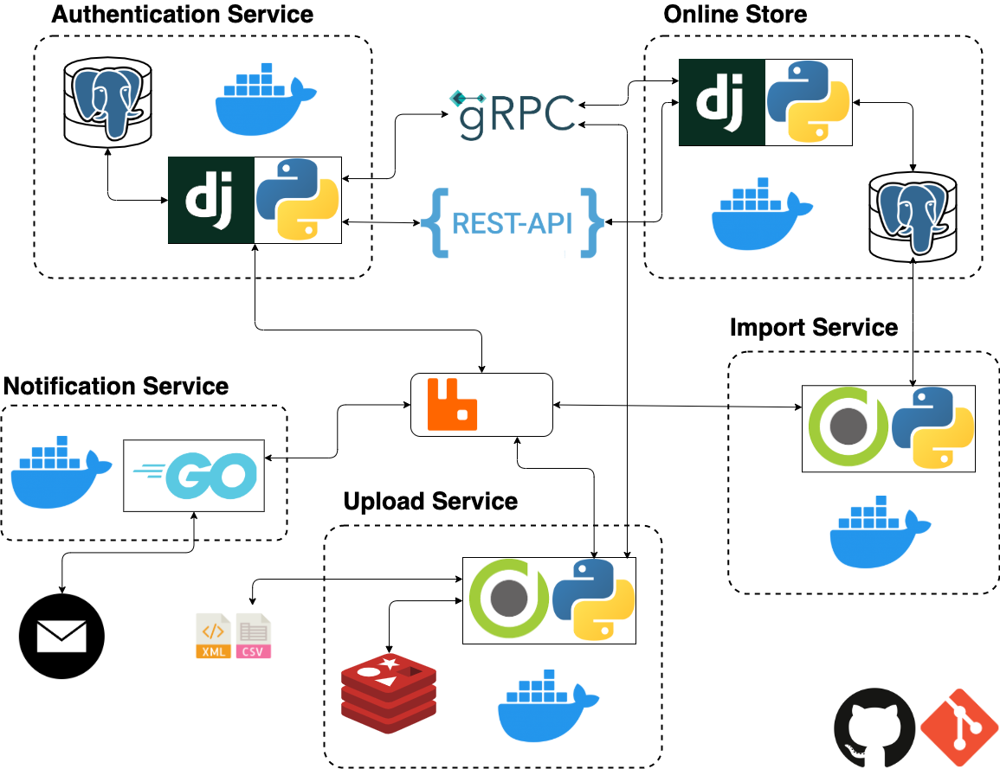

# Distributed Computing

## General 
В данном репозитории представлена группа сервисов, в общем и целом работающих как интернет магазин:
* `online-store` – основной сервис, оперирующий товарами
* `auth` – сервис регистрации и аутентификации пользователей
* `notifications` – сервис уведомлений по почте или СМС
* `mail` – почтовый сервер
* `upload` – сервис для загрузки файлов, содержащих продукты для внесения в базу данных
* `import` – сервис для батчевых добавлений в базу данных

## Architecture


## Deploying With Docker
```bash
docker-compose up
```
