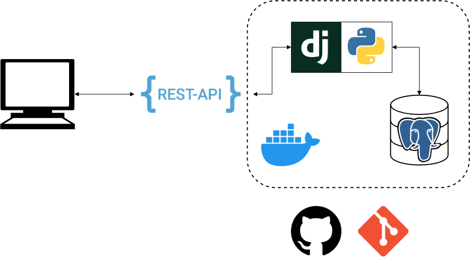

# Online Store

## General

В данной ветке представлены решения ДЗ 1-3. Они были объединены по следующим причинам:
1. ДЗ-2, которое подразумевает подключение БД, описано как бонус к ДЗ-1
2. ДЗ-3, которое требует развёртывания контейнера при помощи `docker-compose`, 
стало обязательным требованием для проверки
3. Так значительно удобнее делать исходное ДЗ-1

Касательно дополнительных заданий:
* пагинация сделана, подробности – в описании API
* хранение в БД реализовано
* логирование также доступно, оно позволяет увидеть все поступающие сервису запросы и информацию по ним
* версионирование поддерживается одним параметром в методы View-классов, это сделать крайне несложно, 
но, в силу отсутствия каких-либо других версий, явного примера нет

## Deploying with Docker-Compose
```bash
docker-compose up
```

## Architecture


## API

У сервиса несколько методов:
1. `GET /product` с параметром `code` позволяет узнать информацию о товаре по его коду
2. `PUT /product` с параметрами `title` и `category` позволяет создать новый товар, в ответ – его код
3. `POST /product` с параметрами `code` и опциональными полями `title` и `category` 
позволяет изменить информацию о продукте по его коду
4. `DELETE /product` с параметром `code` позволяет удалить продукт по его коду
5. `GET /products` с опциональными параметрами `page_size` и `page` позволяет отобразить страницу под номером `page`, 
на которой `page_size` продуктов
6. `PUT /populate` без параметров позволяет заполнить базу данных несколькими товарами для удобства проверки

## Postman Schema 

К решению приложена коллекция для Postman, в которой сохранены примеры запросов API.
